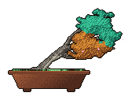

<div align="center">


<br /><br />


# TALHA NIAZI
### `AI Systems & Inference Engineer`

```text
Hardware-Accelerated Inference  |  llama.cpp / Vulkan  |  Deterministic Agents
```

[](https://linkedin.com/in/talhaniazi)
[](https://talnz007.github.io/Portfolio.github.io/)
[](https://pypi.org/project/vulkan-ilm/)

</div>

---

### 💻 SYSTEM TELEMETRY & KERNEL PROFILE

<div align="center">
  
</div>

<details>
<summary><b>View System Configuration & Spec Sheet</b></summary>
<br />

```bash
talha@infer-workstation
-----------------------
Host:     Custom Workstation (Fedora Linux / Kernel 6.x)
Role:     AI Systems & Inference Engineer
Focus:    Local LLM Optimization & Quantization (GGUF/AWQ)
Compute:  Vulkan ICD, DirectML, llama.cpp Compute Layers
Engines:  Python 3.12, C++20, Rust, FastAPI, PyTorch
Infra:    Docker, PostGIS, pgvector, Linux Kernel Internals
Status:   Available for high-impact contracts & remote roles
```
</details>

---

### 🌲 ACTIVE REPOSITORY BONSAI

<div align="center">
  
  <br />
  <p><i>Pixel-art bonsai procedurally grown from commit volume, streaks, and repository longevity.</i></p>
</div>

---

### ⚡ FEATURED INFRASTRUCTURE & ENGINES

| Engine / Platform | Architecture & Scope | Core Stack | Status |
| :--- | :--- | :--- | :--- |
| **[VulkanIlm](https://github.com/Talnz007/VulkanIlm)** | High-throughput local LLM inference wrapper using Vulkan backends via `llama.cpp` for non-CUDA/consumer GPUs. Up to **33× speedup** over CPU execution. | `Python` `C++` `Vulkan` `GGUF` | [](https://pypi.org/project/vulkan-ilm/) |
| **[Buildables AI Track](https://github.com/Talnz007/buildables-ai-fellowship)** | Production LLM curriculum & execution code: Advanced hybrid RAG, structured tool-calling, and evaluation suites. | `FastAPI` `pgvector` `LangGraph` |  |
| **Urban-Intel Engine** | Spatial intelligence platform integrating Vision Transformers, automated raster ingestion, and vector geometry. | `FastAPI` `PostGIS` `PyTorch` |  |

---

### 🛠️ CORE TOOLCHAIN

<div align="center">
  <p>
     &nbsp;
     &nbsp;
     &nbsp;
     &nbsp;
     &nbsp;
     &nbsp;
     &nbsp;
     &nbsp;
     &nbsp;
    
  </p>
</div>

---

### 📻 WORKSPACE STREAM & TELEMETRY

<table width="100%">
  <tr>
    <td width="45%" align="center" valign="middle">
      <h4>Workspace Audio</h4>
      <a href="https://open.spotify.com" target="_blank">
        
      </a>
      <br /><br />
      <p><i>Synced via local workstation session</i></p>
    </td>
    <td width="55%" align="left" valign="top">
      <h4 align="center">Dev Runtime Break</h4>
      <pre><code>$ ./dev-joke.sh

Q: Why do programmers prefer dark mode?
A: Because light attracts bugs.

[Exit Code: 0]</code></pre>
    </td>
  </tr>
</table>

---

<div align="center">
  <a href="https://github.com/Talnz007">
    
  </a>
  <br /><br />
  <code>[SYSTEM STATUS]: Deterministic pipelines &bull; Local weights &bull; Zero hallucinated state</code>
</div>
